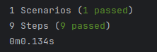

= R5.A.08 -- Dépôt pour les TPs
:icons: font
:MoSCoW: https://fr.wikipedia.org/wiki/M%C3%A9thode_MoSCoW[MoSCoW]

Ce dépôt concerne les rendus de mailto:marco.valle-wellmer@etu.univ-tlse2.fr[VALLE WELLMER Marco Paul].

== TP1

----
Feature: Friday yet feature

  Scenario: saturday isn't friday
    Given Today is "Saturday"
    When I ask whether it's Friday yet
    Then I should be told "Nope"
    Given Today is "Friday"
    When I ask whether it's Friday yet
    Then I should be told "TGIF"
    Given Today is "Anything else!"
    When I ask whether it's Friday yet
    Then I should be told "Nope"

----

== TP2...
